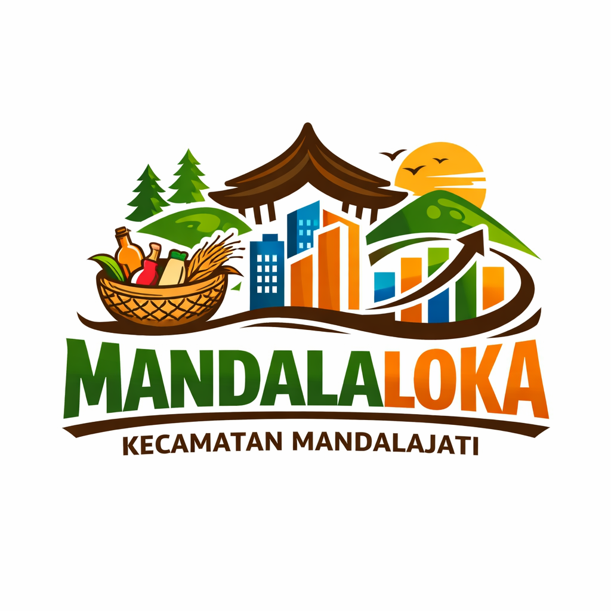

<p align="center">
  
</p>

<h1 align="center">Mandalaloka Apps</h1>

<p align="center">
  <strong>Sistem Informasi Pendataan, Pemetaan Geospasial, dan Pemberdayaan UMKM Terpadu</strong><br>
  <em>Pemerintah Kecamatan Mandalajati, Kota Bandung, Jawa Barat</em>
</p>

<p align="center">
  
  
  
  
  
  
</p>

---

## 📌 Tentang Mandalaloka

**Mandalaloka** adalah platform web terpadu yang dirancang untuk mendigitalkan seluruh siklus pendataan, pemetaan wilayah, etalase promosi, dan program pembinaan Usaha Mikro, Kecil, dan Menengah (UMKM) di wilayah **Kecamatan Mandalajati, Kota Bandung** (meliputi 5 kelurahan: *Karang Pamulang, Sindangjaya, Cikadut, Pasir Impun, dan Jatihandap*).

Platform ini menghubungkan pihak **Pemerintah Kecamatan**, **Petugas Lapangan (Surveyor)**, **Pelaku Usaha**, dan **Masyarakat Publik** dalam satu ekosistem digital yang transparan dan mudah diakses.

---

## 🌟 Fitur Utama Sistem

```
┌────────────────────────────────────────────────────────────────────────┐
│                          EKOSISTEM MANDALALOKA                         │
├───────────────────┬───────────────────┬────────────────────────────────┤
│    PORTAL PUBLIK  │    PELAKU USAHA   │       ADMIN & PETUGAS          │
│  - Katalog Produk │  - Biodata & KTP  │  - Dashboard Statistik Wilayah │
│  - Peta Interaktif│  - Etalase Produk │  - Validasi UMKM & Verifikasi  │
│  - Portal Warta   │  - Pengajuan Dana │  - Watermarking Dokumen KTP    │
│  - Ulasan & Rating│  - Ikut Pelatihan │  - Sensus GPS Lapangan & Foto  │
│  - Asisten Chat   │  - Tiket QR Code  │  - Scanner Presensi Pelatihan  │
└───────────────────┴───────────────────┴────────────────────────────────┘
```

### 1. 📋 Pendataan & Manajemen Profil UMKM
* **Registrasi Mandiri & Sensus Lapangan**:
  * **Pelaku Usaha**: Mendaftarkan profil usaha, legalitas (NIB, PIRT, Halal), modal, omset, dan titik koordinat secara mandiri.
  * **Petugas Lapangan**: Melakukan sensus langsung di lapangan dengan GPS tagging dan dokumentasi foto tempat usaha.
* **Cetak QR Code & Dokumen Resmi**:
  * Generator **QR Code Usaha** untuk display etalase atau kemasan produk.
  * Cetak **Surat Identitas UMKM Terverifikasi** resmi lengkap dengan Kop Surat Pemerintah Kecamatan Mandalajati.

### 2. 🗺️ Pemetaan Geospasial Interaktif (Leaflet & OpenStreetMap)
* **Peta Sebaran Digital**: Menampilkan titik koordinat lokasi fisik seluruh UMKM di 5 Kelurahan Kecamatan Mandalajati.
* **Marker Clustering**: Pengelompokan visual marker saat peta diperkecil untuk performa cepat dan tampilan bersih.
* **Filter Wilayah & Sektor**: Penyaringan data berdasarkan Kelurahan (*Karang Pamulang, Sindangjaya, Cikadut, Pasir Impun, Jatihandap*) dan Sektor Usaha (*Kuliner, Fashion, Kerajinan, Jasa, Pertanian, dll.*).
* **Hubungi via WhatsApp**: Pop-up marker peta menyediakan informasi profil, alamat, dan tombol direct chat WhatsApp ke pemilik usaha.

### 3. 🛍️ Katalog Produk & Ulasan Komunitas
* **Etalase Produk Terverifikasi**: Menampilkan produk-produk unggulan lokal lengkap dengan foto, deskripsi, harga, dan kontak penjual.
* **Rating Bintang & Review**: Pengunjung publik dapat memberikan rating ulasan (1-5 bintang) serta reaksi *Like / Dislike* pada ulasan pembeli.
* **Pencarian Cepat**: Filter pencarian produk berdasarkan nama, sektor, maupun domisili kelurahan.

### 4. 📰 Portal Warta & Publikasi Kecamatan
* **Berita & Pengumuman Resmi**: Publikasi warta kegiatan kecamatan, bazar, pameran UMKM, dan sosialisasi perizinan usaha.
* **Informasi Program & Regulasi**: Panduan tata cara legalitas (NIB, sertifikasi Halal, BPOM) dan informasi agenda dinas.

### 5. 📚 Manajemen Pelatihan & Presensi QR Code Scanner
* **Publikasi & Pendaftaran Pelatihan**: Pelaku UMKM dapat mendaftar pelatihan kewirausahaan secara online dengan alokasi kuota dinamis.
* **Scanner Presensi Real-Time**: Petugas lapangan dapat memindai tiket QR Code peserta di lokasi pelatihan untuk pencatatan kehadiran instan.

### 6. 📑 Pengajuan Program Bantuan Modal & Fasilitasi
* **Pendaftaran Bantuan Online**: Pengunggahan dokumen proposal dan kelengkapan berkas secara mandiri oleh pelaku usaha.
* **Verifikasi Berjenjang**: Peninjauan berkas administratif oleh Admin Kecamatan dan verifikasi fisik lapangan oleh Petugas Lapangan.

### 7. 🛡️ Keamanan Data & Dynamic KTP Watermarking
* **Cek NIK Real-Time**: Validasi NIK otomatis untuk mencegah duplikasi identitas pemilik usaha.
* **Proteksi Watermark KTP**: Berkas scan KTP otomatis dilapisi watermark dinamis nama pemohon dan stempel sistem saat ditinjau Admin guna mencegah penyalahgunaan dokumen identitas.

### 8. 💬 Chatbot Asisten "Mang Loka"
* **Asisten Virtual 24/7**: Chatbot interaktif di halaman depan yang siap membantu masyarakat seputar panduan pendaftaran UMKM, persyaratan bantuan, dan lokasi usaha lokal.

---

## 👥 Hak Akses Pengguna (Role-Based Access Control)

| Modul / Fitur | Super Admin | Admin Kecamatan | Petugas Lapangan | Pelaku UMKM | Publik |
| :--- | :---: | :---: | :---: | :---: | :---: |
| **Dashboard Statistik & Analisis** | ✅ Penuh | ✅ Kecamatan | ✅ Wilayah | ✅ Usaha Sendiri | ❌ |
| **Manajemen Master Data (Wilayah/Sektor)** | ✅ CRUD/Import | ❌ | ❌ | ❌ | ❌ |
| **Verifikasi Akun & KTP Watermarking** | ✅ | ✅ | ❌ | ❌ | ❌ |
| **Validasi Pengajuan UMKM & Bantuan** | ✅ | ✅ | ❌ | ❌ | ❌ |
| **Input Sensus Lapangan (GPS Tagging)** | ✅ | ✅ | ✅ | ❌ | ❌ |
| **Scanner Absensi QR Pelatihan** | ✅ | ✅ | ✅ | ❌ | ❌ |
| **Kelola Profil Usaha & Katalog Produk** | ✅ | ✅ | ❌ | ✅ Usaha Sendiri | ❌ |
| **Daftar Program Pelatihan & Bantuan** | ❌ | ❌ | ❌ | ✅ | ❌ |
| **Portal Warta & Berita Kecamatan** | ✅ Kelola | ✅ Kelola | ❌ | ❌ | ✅ Membaca |
| **Katalog Produk & Review Komunitas** | ✅ Moderasi | ✅ Moderasi | ❌ | ❌ | ✅ Rating/Ulas |
| **Peta Interaktif OpenStreetMap** | ✅ | ✅ | ✅ | ✅ | ✅ |
| **Asisten Chatbot Mang Loka** | ✅ | ❌ | ❌ | ❌ | ✅ 24/7 |
| **Audit Logs & Backup Database** | ✅ | ❌ | ❌ | ❌ | ❌ |

---

## 🛠️ Arsitektur Teknologi

* **Backend Framework**: [Laravel 11](https://laravel.com/) (PHP 8.4+)
* **Basis Data**: [MySQL 8.4](https://www.mysql.com/)
* **Frontend UI**: Blade Modular Partials, [Tailwind CSS](https://tailwindcss.com/), [Alpine.js](https://alpinejs.dev/), [Chart.js](https://www.chartjs.org/)
* **Peta & GIS**: [Leaflet.js](https://leafletjs.com/) & [OpenStreetMap](https://www.openstreetmap.org/)
* **Manajemen Peran**: [Spatie Laravel-Permission](https://spatie.be/docs/laravel-permission/)
* **Keamanan Dokumen**: Dynamic Image Watermarking, Hash SHA-256 NIK, CSRF Protection
* **Mobile REST API**: Laravel Sanctum (Token Authentication untuk aplikasi mobile Flutter `MandalalokaApk`)
* **DevOps & Lingkungan**: Docker, Docker Compose, Laravel Sail, Nginx Reverse Proxy (Gzip & Security Headers)

---

## 🚀 Panduan Menjalankan Aplikasi

### 🐳 Menggunakan Docker / Laravel Sail (Rekomendasi)

1. **Clone Repositori:**
   ```bash
   git clone https://github.com/ikhsanoctav/MandalalokApps.git
   cd MandalalokApps
   ```

2. **Setup File Konfigurasi Environment:**
   ```bash
   cp .env.example .env
   ```

3. **Jalankan Container Docker:**
   ```bash
   ./vendor/bin/sail up -d
   ```

4. **Install Dependensi & Generate Key:**
   ```bash
   ./vendor/bin/sail composer install
   ./vendor/bin/sail artisan key:generate
   ```

5. **Jalankan Migrasi Database & Seeder:**
   ```bash
   ./vendor/bin/sail artisan migrate --seed
   ```

6. **Buat Symlink Penyimpanan Berkas:**
   ```bash
   ./vendor/bin/sail artisan storage:link
   ```

7. **Kompilasi Asset Frontend:**
   ```bash
   ./vendor/bin/sail npm install
   ./vendor/bin/sail npm run dev
   ```

8. **Akses Aplikasi:**
   * **Web Portal:** `http://localhost:8080` (atau `http://localhost`)
   * **phpMyAdmin:** `http://localhost:8081`

---

## 🧪 Pengujian Sistem (Automated Testing)

Aplikasi dilengkapi dengan rangkaian automated test suite (*Feature & Unit Tests*) berbasis PHPUnit:

```bash
# Menjalankan seluruh pengujian fitur dan unit
./vendor/bin/sail test
```

Tersedia juga modul skenario pengujian otomatis:
* **Katalon Studio**: Direktori `katalon/`
* **Selenium WebDriver**: Direktori `selenium/`

---

## 📁 Struktur Direktori Proyek

```text
MandalalokaApps/
├── app/
│   ├── Http/Controllers/
│   │   ├── SuperAdmin/          # Kontrol Master Data, Users, Logs, Settings, Kop Surat
│   │   ├── Admin/               # Verifikasi Akun KTP, Validasi UMKM, Bantuan, Pelatihan
│   │   ├── Petugas/             # Pendataan Lapangan, Verifikasi Fisik, QR Presensi
│   │   ├── Pelaku/              # Profil Pemilik, Registrasi Usaha, Produk, Pengajuan
│   │   └── Api/                 # Endpoint REST API (Statistik, Peta, Chatbot, Mobile)
│   ├── Models/                  # Model Eloquent (UMKM, Pemilik, Produk, Pelatihan, dll.)
│   ├── Services/                # Service Layer (UmkmService, PengajuanService, AktivitasLogger)
│   └── Http/Middleware/         # Middleware Role & EnsureProfilCompleted
├── database/
│   ├── migrations/              # Skema tabel database
│   └── seeders/                 # Seeder master 5 Kelurahan, RW/RT, Sektor, & Akun Default
├── resources/views/
│   ├── landing/partials/        # Partials modular Landing Page (Head, Navbar, Hero, Map, dll.)
│   ├── superadmin/              # Panel UI Super Admin
│   ├── admin/                   # Panel UI Admin Kecamatan
│   ├── petugas/                 # Panel UI Petugas Lapangan
│   ├── pelaku/                  # Panel UI Pelaku UMKM
│   └── welcome.blade.php        # Layout utama halaman depan
├── routes/
│   ├── web.php                  # Rute antarmuka web
│   ├── api.php                  # Rute API RESTful (Sanctum)
│   └── auth.php                 # Rute autentikasi
├── docker-compose.prod.yml      # Konfigurasi deploy production VPS
└── compose.yaml                 # Konfigurasi container lokal (Sail)
```

---

## 🏛️ Wilayah Cakupan Kecamatan Mandalajati

Sistem ini melayani pendataan UMKM pada 5 Kelurahan resmi di Kecamatan Mandalajati, Kota Bandung:
1. **Kelurahan Karang Pamulang** (Kode: `KEL-001`)
2. **Kelurahan Sindangjaya** (Kode: `KEL-002`)
3. **Kelurahan Cikadut** (Kode: `KEL-003`)
4. **Kelurahan Pasir Impun** (Kode: `KEL-004`)
5. **Kelurahan Jatihandap** (Kode: `KEL-005`)

---

## 📄 Lisensi

Platform Mandalaloka dikembangkan untuk tata kelola pendataan dan pemberdayaan UMKM Kecamatan Mandalajati, Kota Bandung. Dilindungi di bawah lisensi [MIT License](LICENSE).
