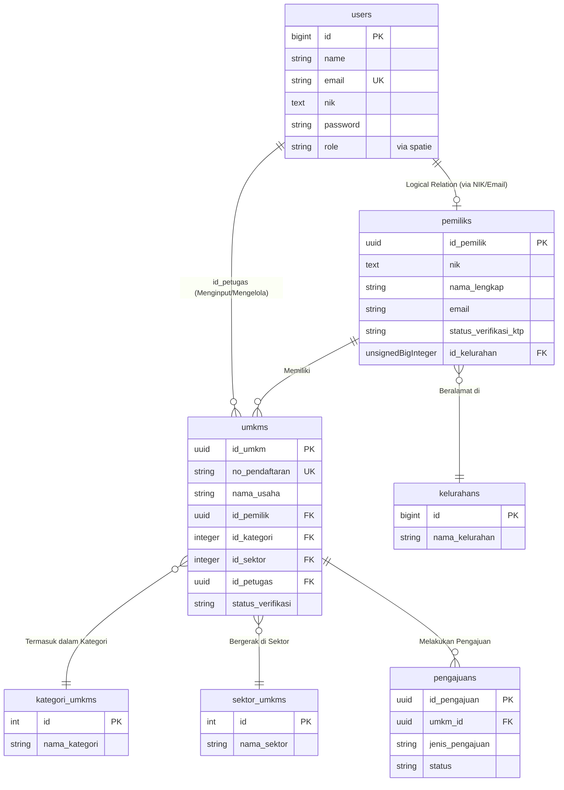

# Database Schema & Data Structure

Dokumen ini menjelaskan struktur basis data relasional (RDBMS) yang digunakan dalam Sistem Informasi UMKM Mandalaloka, beserta relasi (Entity Relationship) antar tabel-tabel utamanya.

## 1. Entity Relationship Diagram (ERD)

Diagram di bawah ini menggambarkan relasi tingkat tinggi antara entitas utama dalam sistem.

> [!NOTE]
> Relasi antara `users` dan `pemiliks` dihubungkan secara logis pada tataran aplikasi (melalui `nik` atau `email`). Akun `users` dengan peran `pelaku_umkm` adalah kredensial login dari data profil `pemiliks`.

## 2. Struktur Tabel & Penjelasan

### 2.1. Tabel `users`
Menyimpan informasi autentikasi seluruh pengguna sistem (Super Admin, Admin, Operator, Pelaku UMKM).
- **id**: Primary Key, Auto Increment.
- **name, email, password**: Kredensial standar Laravel.
- **nik**: Disimpan terenkripsi. Berfungsi untuk mencocokkan data akun dengan profil `pemiliks`.
- *Relasi Role*: Role pengguna diatur melalui tabel *Spatie Permission* (`model_has_roles`).

### 2.2. Tabel `pemiliks`
Menyimpan detail demografis pemilik/pelaku UMKM.
- **id_pemilik**: UUID, Primary Key.
- **nik**: Disimpan terenkripsi (`Crypt`), dilindungi dengan hash index (`nik_hash`) agar bisa dicari.
- **nama_lengkap, alamat, kontak**: Profil pemilik.
- **status_verifikasi_ktp**: `pending`, `terverifikasi`, atau `ditolak`.

### 2.3. Tabel `umkms`
Tabel sentral (transaksional) yang merepresentasikan satu badan atau entitas usaha.
- **id_umkm**: UUID, Primary Key.
- **no_pendaftaran**: String unik yang di-generate sistem saat pendaftaran.
- **id_pemilik**: Foreign Key (logical/UUID) mengarah ke `pemiliks.id_pemilik`.
- **id_kategori**: Skala usaha (1=Mikro, 2=Kecil, 3=Menengah).
- **id_sektor**: Jenis/bidang industri (Kuliner, Fashion, Jasa, dll).
- **id_petugas**: Merujuk ke `users.id` sebagai Operator Lapangan yang pertama kali memasukkan data.
- **status_verifikasi**: Workflow dokumen (`draft`, `terkirim`, `terverifikasi`, `ditolak`).

### 2.4. Tabel `pengajuans`
Menyimpan riwayat pengajuan layanan atau perizinan dari sebuah UMKM ke kecamatan.
- **id_pengajuan**: UUID, Primary Key.
- **umkm_id**: Foreign Key merujuk secara ketat ke `umkms.id_umkm` (`onDelete('cascade')`).
- **jenis_pengajuan**: Enum (pembiayaan, bantuan, perizinan, lainnya).
- **status**: Menunggu, proses, disetujui, ditolak.

### 2.5. Tabel Referensi & Wilayah (Master Data)
- **kategori_umkms**: Master tabel kategori (Berdasarkan aset / omzet standar).
- **sektor_umkms**: Master bidang usaha.
- **kelurahans, rws, rts**: Struktur hierarkis area geografis Kecamatan Mandalajati.

## 3. Aturan Integritas Data (Data Integrity)
- **Penghapusan Beruntun (Cascade Delete)**: Jika sebuah `umkms` dihapus, maka seluruh data `pengajuans` yang berelasi dengan UMKM tersebut juga akan dihapus.
- **Enkripsi NIK**: Untuk menjaga privasi, Laravel menangani mutator (Get/Set) pada properti `nik` di model `Pemilik` dan `User` menggunakan `Crypt::encryptString`. Pencarian (*query where*) mengandalkan kolom tambahan `nik_hash` yang menyimpan format hash satu arah (SHA-256) dari NIK mentah.
