# Product Requirements Document (PRD)
## Sistem Informasi UMKM Kecamatan Mandalajati (MandalalokaApps)

---

## 1. Pendahuluan
Dokumen ini mendeskripsikan spesifikasi produk untuk **Sistem Informasi UMKM Kecamatan Mandalajati (MandalalokaApps)**. Sistem ini dirancang untuk mendigitalkan proses pendataan, verifikasi, dan pelaporan UMKM agar lebih terstruktur, transparan, dan terpusat.

---

## 2. Masalah yang Dihadapi (Problem Statement)
Sebelum adanya sistem ini, pengelolaan data UMKM di wilayah Kecamatan Mandalajati menghadapi berbagai tantangan berikut:

* 📝 **Pendataan Manual & Terfragmentasi:** Pencatatan UMKM masih menggunakan kertas atau berkas *spreadsheet* (Excel) terpisah di tingkat RT, RW, maupun Kelurahan. Hal ini menyebabkan risiko kehilangan berkas, data tidak sinkron, dan duplikasi data yang tinggi.
* ⏳ **Proses Verifikasi Lambat:** Verifikasi berkas fisik usaha dan KTP pemilik memakan waktu lama karena pemohon harus datang langsung menyerahkan dokumen ke kantor kecamatan.
* 📊 **Kesulitan Analisis Data (Data-Driven):** Pimpinan daerah (Camat/Lurah) tidak memiliki visualisasi data yang *real-time* untuk melihat sebaran UMKM, sektor potensial, dan tingkat penyerapan tenaga kerja guna mengambil keputusan strategis atau menyalurkan bantuan secara tepat sasaran.
* 📢 **Kesenjangan Informasi:** Pelaku UMKM sulit mendapatkan warta pelatihan terbaru serta melacak status pengajuan layanan/bantuan mereka.

---

## 3. Tujuan Bisnis (Business Objectives)
* **Pusat Data Terpadu (Single Source of Truth):** Mengintegrasikan data UMKM dari tingkat RT/RW, Kelurahan, hingga Kecamatan ke dalam satu platform.
* **Efisiensi Operasional:** Mempermudah Operator Lapangan dalam mendata usaha secara digital dan mempermudah Admin Kecamatan dalam memverifikasi berkas secara efisien.
* **Pemberdayaan Pelaku Usaha:** Memberikan kemudahan bagi Pelaku UMKM untuk mendaftar, memperbarui profil, dan memantau status pengajuan mereka.
* **Pendukung Keputusan (Decision Support System):** Menyediakan analitik data untuk pimpinan kecamatan sebagai landasan dalam merumuskan program kerja, pelatihan, dan kebijakan pemerataan ekonomi antarwilayah.

---

## 4. Target Pengguna (User Personas) / Buat Siapa

| Role | Target Pengguna | Tanggung Jawab Utama dalam Sistem |
| :--- | :--- | :--- |
| **1. Pelaku UMKM** | Pemilik usaha lokal di Mandalajati | - Mendaftarkan usaha secara mandiri - Mengelola profil & katalog produk - Melacak status pengajuan layanan/bantuan |
| **2. Operator Lapangan** | Petugas survei & pendata lapangan | - Melakukan input data UMKM baru hasil survei fisik - Mengunggah foto lokasi & berkas pendukung |
| **3. Admin Kecamatan** | Staf pelayanan kantor kecamatan | - Melakukan verifikasi data UMKM & validasi KTP pemilik - Mengelola permohonan layanan/bantuan - Meninjau laporan statistik |
| **4. Super Admin** | Pengelola sistem IT kecamatan | - Mengelola master data & konfigurasi sistem - Mengatur hak akses pengguna (*Role-Based Access Control*) |

---

## 5. Fitur Utama (Key Features)

### 👤 5.1. Autentikasi & Otorisasi (RBAC)
* Sistem masuk (Login) yang aman menggunakan hak akses berbasis peran.
* Pengguna otomatis diarahkan ke *dashboard* yang relevan dengan tugas dan tanggung jawab masing-masing setelah berhasil login.

### 📋 5.2. Pendataan & Alur Kerja Verifikasi
* Formulir pendaftaran usaha digital yang komprehensif.
* Alur status (*workflow*) pengajuan yang transparan:
  $$\text{Draft} \longrightarrow \text{Terkirim} \longrightarrow \text{Terverifikasi / Ditolak (disertai catatan)}$$

### 💳 5.3. Verifikasi KTP & Akun Pemilik
* Modul peninjauan dokumen identitas (KTP) pemilik usaha oleh Admin Kecamatan (dilengkapi dengan watermarking otomatis dan storage privat) sebelum akun diaktifkan.

### 💼 5.4. Layanan Pengajuan & Warta UMKM
* **Pengajuan Layanan:** Wadah bagi pemilik usaha untuk memohon bantuan modal, izin usaha, atau keikutsertaan program pelatihan kecamatan.
* **Warta Berita:** Publikasi warta, pengumuman, dan artikel pembinaan UMKM oleh Admin.

### 📊 5.5. Analitik & Laporan (Decision Support Dashboard)
* Visualisasi grafik interaktif sebaran UMKM per kelurahan.
* Klasifikasi data berdasarkan skala (Mikro, Kecil, Menengah) dan sektor usaha (Kuliner, Jasa, Fashion, dsb.) guna mempermudah analisis serapan tenaga kerja dan perumusan kebijakan.

### 🤖 5.6. Asisten AI Terintegrasi (Chatbot)
* Layanan tanya-jawab otomatis 24/7 di halaman publik menggunakan integrasi platform **n8n** dan model **LLM (Gemini/Groq)** untuk menjawab pertanyaan seputar UMKM secara *real-time*.

---

## 6. Bukan Fiturnya (Out of Scope / Batasan Sistem)
Untuk memfokuskan pengembangan pada tujuan utama, hal-hal berikut **tidak tercakup** dalam sistem ini:

* 🚫 **Transaksi E-Commerce & Payment Gateway:** Tidak ada sistem keranjang belanja (*shopping cart*) dan pemrosesan pembayaran online langsung (seperti Midtrans/Xendit) untuk penjualan produk.
* 🚫 **Sistem Kasir (Point of Sale - POS):** Tidak menyediakan pencatatan transaksi kasir harian, struk belanja, maupun manajemen stok barang toko secara dinamis.
* 🚫 **Logistik & Ekspedisi:** Tidak terintegrasi dengan layanan kurir pengiriman barang maupun kalkulasi ongkos kirim.
* 🚫 **Akuntansi Keuangan Kompleks:** Tidak mencakup pembuatan laporan neraca keuangan, jurnal umum, atau perhitungan rugi-laba detail untuk internal usaha.

---

## 7. Kriteria Sukses (Success Metrics)
Aplikasi dianggap sukses apabila memiliki navigasi yang intuitif, ramah pengguna, dan memungkinkan pengguna menyelesaikan tugas utama mereka **maksimal dalam 3 klik** dari Dashboard Utama.

### Metrik 3-Klik (3-Click Rule)
Berikut adalah alur penyelesaian tugas utama dengan maksimal 3 klik:

```mermaid
graph TD
    subgraph Alur Admin - Verifikasi UMKM
    A[Dashboard Admin] -->|Klik 1: Verifikasi Pengajuan| B[Daftar Pengajuan UMKM]
    B -->|Klik 2: Detail| C[Detail Pengajuan UMKM]
    C -->|Klik 3: Setujui / Verifikasi| D[Selesai: UMKM Terverifikasi]
    end

    subgraph Alur Operator - Tambah UMKM
    E[Dashboard Operator] -->|Klik 1: Tambah UMKM| F[Form Data Pemilik]
    F -->|Klik 2: Simpan Data Pemilik| G[Form Detail Usaha]
    G -->|Klik 3: Kirim Pengajuan| H[Selesai: Pengajuan Terkirim]
    end

    subgraph Alur Pelaku UMKM - Cek Status
    I[Dashboard UMKM] -->|Klik 1: Pengajuan Saya| J[Daftar Pengajuan]
    J -->|Klik 2: Detail / Mata| K[Detail Pengajuan]
    K -->|Klik 3: Tab Riwayat Status| L[Selesai: Status Terlihat]
    end
```

1. **Admin memverifikasi UMKM:**
   - **Klik 1:** Klik menu **"Verifikasi Pengajuan"** pada sidebar dashboard.
   - **Klik 2:** Klik tombol **"Detail"** pada pengajuan berstatus *Terkirim*.
   - **Klik 3:** Klik tombol **"Setujui" / "Verifikasi"** pada halaman detail.

2. **Operator mendaftarkan UMKM Baru:**
   - **Klik 1:** Klik tombol **"Tambah UMKM"** pada Dashboard utama.
   - **Klik 2:** Isi form pemilik dan klik tombol **"Simpan Data Pemilik"**.
   - **Klik 3:** Isi form usaha dan klik tombol **"Kirim Pengajuan"**.

3. **Pelaku UMKM melihat status pengajuan bantuan/layanan:**
   - **Klik 1:** Klik menu **"Pengajuan Saya"** pada sidebar dashboard.
   - **Klik 2:** Klik ikon **"Detail (Mata)"** pada baris pengajuan yang ingin dilihat.
   - **Klik 3:** Klik tab **"Riwayat Status"** untuk memantau progres pelacakan.
