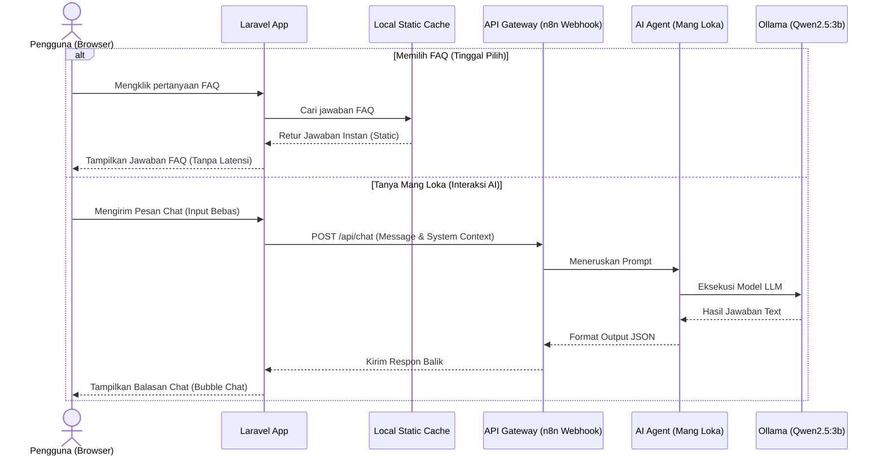
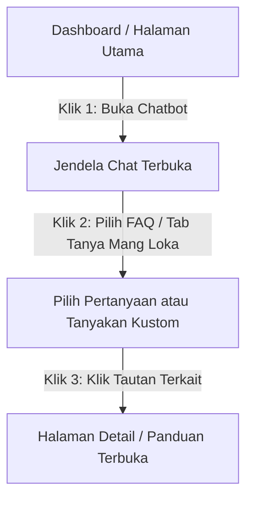

# Product Requirements Document (PRD)
## Fitur: Asisten AI "Mang Loka" (Chatbot Pintar UMKM Mandalajati)

---

## 1. Pendahuluan
Dokumen ini mendeskripsikan spesifikasi produk untuk fitur **Asisten AI "Mang Loka"**, sebuah chatbot pintar terintegrasi dalam platform **MandalalokaApps**. Chatbot ini berfungsi sebagai pusat bantuan otomatis 24/7 untuk melayani tanya-jawab publik, merekomendasikan UMKM lokal, serta memandu pelaku usaha dalam proses pendaftaran dan verifikasi.

---

## 2. Masalah yang Dihadapi (Problem Statement)
* 🕒 **Keterbatasan Waktu Pelayanan:** Layanan informasi administrasi di Kecamatan Mandalajati hanya beroperasi pada jam kerja (Senin - Jumat, 08:00 - 16:00). Pelaku usaha sering membutuhkan informasi di luar jam kerja tersebut.
* 🔄 **Pertanyaan Berulang (FAQ):** Admin Kecamatan menghabiskan banyak waktu untuk menjawab pertanyaan berulang secara manual, seperti syarat verifikasi KTP (termasuk penjelasan secure watermarking), alur perolehan status terverifikasi, dan jenis dokumen legalitas.
* 🔍 **Kesulitan Menemukan UMKM Lokal:** Wisatawan atau masyarakat umum kesulitan mencari rekomendasi produk lokal unggulan di Mandalajati karena minimnya kurasi interaktif.

---

## 3. Buat Siapa (Target Pengguna)

| Pengguna | Peran & Kebutuhan Utama |
| :--- | :--- |
| **1. Pelaku UMKM** | Memerlukan panduan interaktif tentang cara mendaftar usaha, syarat verifikasi KTP (dengan jaminan perlindungan data), serta status pengajuannya. |
| **2. Pengunjung Publik (Masyarakat/Wisatawan)** | Membutuhkan rekomendasi cepat mengenai produk unggulan (kuliner, jasa, kerajinan) dan sebaran UMKM terdekat di kelurahan Mandalajati. |
| **3. Operator Lapangan** | Memerlukan jawaban instan terkait kebijakan operasional pendataan di lapangan jika menemui kasus khusus. |
| **4. Admin Kecamatan** | Membutuhkan sistem otomatis untuk memfilter pertanyaan umum sehingga beban kerja administratif berkurang. |

---

## 4. Desain Struktur Antarmuka (Chatbot UI Layout)
Untuk memberikan pengalaman pengguna yang efisien, antarmuka Chatbot "Mang Loka" disatukan dalam satu layar percakapan terpadu yang terdiri atas:

```
+-------------------------------------------------+
|               Chatbot Mang Loka                 |
+-------------------------------------------------+
|  [Pesan Selamat Datang dari Mang Loka]          |
|                                                 |
|  * Pertanyaan Dasar (Tinggal Pilih):            |
|    - [📝 Cara Daftar Akun]                      |
|    - [👤 Syarat Verifikasi KTP]                 |
|    - [⏳ Lama Verifikasi]                       |
|    - [🏬 Daftar Usaha Baru]                     |
|                                                 |
|  ---------------------------------------------  |
|  Tanya Mang Loka (AI Chat)                      |
|  [Area Obrolan Dinamis & Riwayat Chat AI]       |
+-------------------------------------------------+
|  [Input Teks Chat...]                    [Kirim]|
+-------------------------------------------------+
```

### 🗂️ 4.1. Bagian FAQ & Pertanyaan Dasar (Tinggal Pilih)
* **Karakteristik:** Menampilkan daftar pertanyaan dasar (*Frequently Asked Questions*) dalam format tombol siap klik di awal percakapan.
* **Mekanisme Kerja:** 
  - Pengguna tidak perlu mengetik; cukup mengklik salah satu tombol pertanyaan dasar.
  - Pertanyaan akan dicetak sebagai gelembung pesan pengguna, lalu jawaban dicetak secara instan dari *static cache* lokal (tanpa memanggil API LLM/AI).
  - Menghemat token LLM, menghilangkan latensi, dan memberikan jawaban akurat.
* **Topik Utama FAQ:**
  - Prosedur registrasi akun & verifikasi KTP pemilik (disertai perlindungan watermark dinamis).
  - Dokumen wajib untuk izin usaha (NIB, SKU, dll).
  - Durasi verifikasi & status penolakan berkas.

### 💬 4.2. Bagian Tanya Mang Loka (Interaksi AI)
* **Karakteristik:** Panel obrolan interaktif bebas di bagian bawah layar yang dipisahkan oleh garis pembatas.
* **Mekanisme Kerja:**
  - Pengguna dapat mengetik pertanyaan bebas (*custom query*) melalui kolom input teks di bagian bawah.
  - Pesan dikirim secara dinamis ke model AI (Ollama Qwen2.5:3b via n8n) menggunakan NLP.
  - AI akan membalas dengan jawaban personal yang kontekstual.

---

## 5. Fitur Utama Asisten AI (Key Features)

### 🤖 5.1. Pemrosesan Bahasa Alami (NLP) Berbasis AI
* Memahami pertanyaan dalam Bahasa Indonesia sehari-hari dan Bahasa Sunda ringan (kontekstual lokal).
* Menggunakan model bahasa **LLM (Ollama Qwen2.5:3b)** untuk memberikan respon percakapan yang humanis dan natural pada panel *Tanya Mang Loka*.

### 📚 5.2. Panduan Prosedur Terintegrasi (RAG)
* Memberikan penjelasan akurat mengenai langkah-langkah administratif, seperti:
  $$\text{Daftar Akun} \longrightarrow \text{Verifikasi KTP (Secure)} \longrightarrow \text{Registrasi UMKM} \longrightarrow \text{Pemeriksaan Admin}$$
* Mengambil informasi valid dari berkas warta dan basis pengetahuan resmi kecamatan Mandalaloka.

### 🛍️ 5.3. Sistem Rekomendasi UMKM Interaktif
* Memandu pengunjung menemukan UMKM berdasarkan sektor usaha (Kuliner, Jasa, Fashion) atau wilayah kelurahan dengan memberikan link langsung ke profil UMKM tersebut.

---

## 6. Alur Integrasi Sistem (System Architecture Flow)
Untuk panel *Tanya Mang Loka*, chatbot memanfaatkan orkestrasi **n8n** sebagai API Gateway yang menghubungkan Laravel frontend dengan model LLM.



---

## 7. Bukan Fiturnya (Out of Scope / Batasan Sistem)
Untuk mencegah penyalahgunaan dan menjaga integritas data, Asisten AI "Mang Loka" **tidak diperbolehkan** untuk:
* ❌ **Memproses Verifikasi Dokumen:** AI tidak dapat menyetujui, menolak, atau memvalidasi KTP dan berkas UMKM (tugas ini mutlak milik Admin Kecamatan).
* ❌ **Memanipulasi Database:** AI tidak dapat mengubah data pemilik, nama usaha, atau status verifikasi langsung di database platform.
* ❌ **Transaksi Finansial:** Tidak mendukung pembayaran produk UMKM atau pengiriman uang bantuan.

---

## 8. Kriteria Sukses (Success Metrics)

### Metrik Kecepatan & Akurasi
* **Waktu Respons FAQ:** Instan ($< 100\text{ ms}$).
* **Waktu Respons Tanya Mang Loka (AI):** Di bawah **3 detik**.
* **Tingkat Akurasi Pengetahuan:** $> 90\%$ kecocokan informasi administratif dengan dokumen panduan resmi kecamatan (menghindari halusinasi AI).

### Metrik 3-Klik (3-Click Rule)
Pengguna harus dapat memperoleh informasi/rekomendasi spesifik dari chatbot dalam maksimal **3 klik**:



1. **Pengunjung menggunakan FAQ:**
   - **Klik 1:** Klik tombol mengambang (*floating chat widget*) **"Tanya Mang Loka"**.
   - **Klik 2:** Klik pertanyaan FAQ *"Syarat Verifikasi KTP Pemilik"*.
   - **Klik 3:** Klik link menuju *"Halaman Pengaturan Akun"* untuk unggah KTP (dengan perlindungan keamanan).

2. **Pengunjung mencari rekomendasi UMKM via Tanya Mang Loka (AI):**
   - **Klik 1:** Klik tombol mengambang **"Tanya Mang Loka"**.
   - **Klik 2:** Buka tab *"Tanya Mang Loka"*, ketik *"rekomendasi makanan"* lalu tekan kirim.
   - **Klik 3:** Klik tautan UMKM Kuliner (misal: *Bakso Beranak*) yang direkomendasikan AI.
