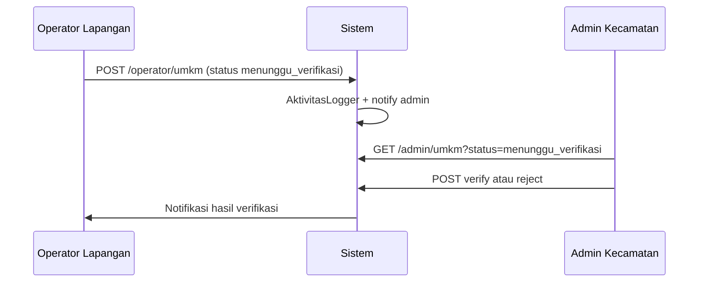

# Rancangan Modul Admin Kecamatan & Operator Lapangan

Dokumen ini merancang pengembangan modul untuk dua role yang saat ini masih placeholder di `routes/web.php`.

---

## 1. Ringkasan Peran

| Aspek | Admin Kecamatan | Operator Lapangan |
|--------|-----------------|-------------------|
| **Prefix URL** | `/admin` | `/operator` |
| **Layout** | `layouts.admin` (turunan pola superadmin) | `layouts.operator` |
| **Fokus utama** | Verifikasi, monitoring wilayah, pengajuan, laporan | Pendataan UMKM di lapangan |
| **Verifikasi UMKM** | Ya (menunggu_verifikasi → terverifikasi/ditolak) | Tidak (hanya input, status `menunggu_verifikasi`) |
| **Kelola user** | Tidak | Tidak |
| **Pengaturan sistem** | Tidak | Tidak |

### Permission Spatie (sudah disiapkan di `rolesIndex`)

| Permission | Super Admin | Admin Kecamatan | Operator Lapangan |
|------------|:-----------:|:---------------:|:-----------------:|
| `view_dashboard` | ✓ | ✓ | ✓ |
| `manage_umkm` | ✓ | ✓ | ✓ |
| `verify_umkm` | ✓ | ✓ | — |
| `view_reports` | ✓ | ✓ | — |
| `manage_users` | ✓ | — | — |
| `manage_system` | ✓ | — | — |

---

## 2. Arsitektur yang Disarankan

```
app/Http/Controllers/
├── SuperAdmin/          ← sudah diimplementasi
├── AdminKecamatan/
│   ├── DashboardController.php
│   ├── UmkmController.php      (verifikasi + lihat/edit terbatas)
│   ├── PengajuanController.php
│   └── LaporanController.php
└── Operator/
    ├── DashboardController.php
    └── UmkmController.php        (CRUD pendataan, tanpa verify)

app/Services/
├── AktivitasLogger.php           ← sudah ada, dipakai semua role
└── UmkmRegistrationService.php   ← ekstrak logika store dari controller (opsional fase 2)

routes/
├── superadmin.php                ← sudah ada
├── admin.php                     ← baru
└── operator.php                  ← baru
```

**Middleware route:** `['auth', 'role:admin_kecamatan']` dan `['auth', 'role:operator_lapangan']`.

**Middleware permission (fase 2):** `permission:verify_umkm` pada route verify/reject admin.

---

## 3. Redirect Setelah Login

Tambahkan `App\Http\Middleware\RedirectByRole` atau perbarui `AuthenticatedSessionController`:

| Role | Redirect |
|------|----------|
| `super_admin` | `route('superadmin.dashboard')` |
| `admin_kecamatan` | `route('admin.dashboard')` |
| `operator_lapangan` | `route('operator.dashboard')` |

Registrasi publik (`/register`) sebaiknya dinonaktifkan di produksi; user hanya dibuat oleh Super Admin.

---

## 4. Modul Admin Kecamatan

### 4.1 Dashboard (`GET /admin/dashboard`)

**KPI (scope kecamatan Mandalajati, sama dengan super admin saat ini):**

- Total UMKM, pending verifikasi (`menunggu_verifikasi`), terverifikasi
- Pengajuan menunggu / proses
- Grafik pendaftaran & verifikasi 6 bulan terakhir
- Distribusi per kelurahan
- 5 UMKM terbaru pending

**Perbedaan vs Super Admin:** tanpa widget jumlah admin/operator, tanpa status server/cache.

### 4.2 Data UMKM

| Route | Method | Aksi |
|-------|--------|------|
| `/admin/umkm` | GET | Daftar + filter (sama superadmin) |
| `/admin/umkm/{id}` | GET | Detail |
| `/admin/umkm/{id}/modal` | GET | Modal AJAX |
| `/admin/umkm/{id}/verify` | POST | Set `terverifikasi` |
| `/admin/umkm/{id}/reject` | POST | Set `ditolak` + `catatan_penolakan` |

**Tidak ada:** create, edit penuh, delete (delegasi ke super admin jika data salah).

**Reuse:** trait `VerifiesUmkm` atau service bersama dengan `SuperAdmin\UmkmController::umkmVerify/Reject`.

### 4.3 Pengajuan

| Route | Method | Aksi |
|-------|--------|------|
| `/admin/pengajuan` | GET | Index + statistik |
| `/admin/pengajuan/{id}/modal` | GET | Detail |
| `/admin/pengajuan/{id}/status` | POST | Update `proses` / `disetujui` / `ditolak` |

Sama dengan super admin, tanpa hapus data.

### 4.4 Laporan

| Route | Method | Aksi |
|-------|--------|------|
| `/admin/laporan` | GET | Filter periode, kelurahan, kategori |
| `/admin/laporan/export` | GET | Excel/PDF (fase implementasi) |

Data dinamis dari query `UMKM` + `Pengajuan`, menggantikan angka statis di view saat ini.

### 4.5 Menu sidebar Admin

- Dashboard
- Data UMKM → Daftar, UMKM Pending (badge)
- Data Pengajuan
- Laporan
- Profil

---

## 5. Modul Operator Lapangan

### 5.1 Dashboard (`GET /operator/dashboard`)

- Total UMKM yang diinput operator ini (`id_petugas = auth()->id()`)
- Draft / menunggu_verifikasi / ditolak (agar bisa perbaiki)
- Shortcut: **Tambah UMKM Baru**
- Peta/list UMKM terakhir diinput (5 record)

### 5.2 Data UMKM (pendataan)

| Route | Method | Aksi |
|-------|--------|------|
| `/operator/umkm` | GET | Hanya UMKM milik `id_petugas = auth()->id()` |
| `/operator/umkm/create` | GET/POST | Form lengkap (reuse view dengan partial) |
| `/operator/umkm/{id}/edit` | GET/PUT | Edit jika status `draft`, `menunggu_verifikasi`, atau `ditolak` |
| `/operator/umkm/{id}` | GET | Detail read-only jika sudah `terverifikasi` |

**Aturan bisnis:**

- Create: `status_verifikasi = menunggu_verifikasi`, `id_petugas = auth()->id()`
- Edit setelah `terverifikasi`: ditolak (tampilkan pesan hubungi admin)
- Resubmit ditolak: ubah data → set kembali `menunggu_verifikasi`, hapus `catatan_penolakan`

**Tidak ada:** verify, reject, delete, export global.

### 5.3 Menu sidebar Operator

- Dashboard
- Data UMKM → Daftar Saya, Tambah UMKM
- Profil

---

## 6. Strategi Reuse View & Controller

### Opsi A — View terpisah (disarankan fase 1)

```
resources/views/
├── superadmin/   (existing)
├── admin/        (copy adaptasi, layout admin)
└── operator/
```

Keuntungan: UI bisa disederhanakan per role tanpa `@can` berlebihan.

### Opsi B — View komponen bersama

```
resources/views/umkm/
├── _form.blade.php
├── _table.blade.php
└── index.blade.php  → @extends dinamis berdasarkan $layout
```

Controller meneruskan `'layout' => 'layouts.admin'`.

### Logika bisnis bersama

```php
// app/Services/UmkmRegistrationService.php
public function store(Request $request, User $petugas): UMKM
public function update(Request $request, UMKM $umkm, User $actor): UMKM
```

`SuperAdmin\UmkmController` dan `Operator\UmkmController` memanggil service yang sama.

---

## 7. Audit & Notifikasi

Semua aksi penting memanggil:

```php
AktivitasLogger::log($deskripsi, $type, $umkmId, $request);
```

Notifikasi database ke user terkait (opsional):

- Operator submit → notify admin kecamatan + super admin
- Admin verify/reject → notify operator (`id_petugas`)
- Pengajuan disetujui/ditolak → notify pemilik via email (fase 3)

---

## 8. Urutan Implementasi

| Fase | Deliverable | Estimasi relatif |
|------|-------------|------------------|
| **1** | `RedirectByRole`, `routes/admin.php`, `routes/operator.php`, layout + dashboard stub dengan data nyata | 1–2 hari |
| **2** | Operator: CRUD UMKM (reuse service), scope `id_petugas` | 2–3 hari |
| **3** | Admin: verifikasi UMKM + pengajuan | 2 hari |
| **4** | Admin: laporan dinamis + export | 2 hari |
| **5** | Permission middleware, nonaktifkan register, uji feature | 1 hari |

---

## 9. Contoh `routes/admin.php`

```php
<?php

use App\Http\Controllers\AdminKecamatan\DashboardController;
use App\Http\Controllers\AdminKecamatan\PengajuanController;
use App\Http\Controllers\AdminKecamatan\UmkmController;
use App\Http\Controllers\AdminKecamatan\LaporanController;
use Illuminate\Support\Facades\Route;

Route::middleware(['auth', 'role:admin_kecamatan'])
    ->prefix('admin')
    ->name('admin.')
    ->group(function () {
        Route::get('/dashboard', [DashboardController::class, 'index'])->name('dashboard');

        Route::get('/umkm', [UmkmController::class, 'index'])->name('umkm.index');
        Route::get('/umkm/{id}', [UmkmController::class, 'show'])->name('umkm.show');
        Route::get('/umkm/{id}/modal', [UmkmController::class, 'modal'])->name('umkm.modal');
        Route::post('/umkm/{id}/verify', [UmkmController::class, 'verify'])->name('umkm.verify');
        Route::post('/umkm/{id}/reject', [UmkmController::class, 'reject'])->name('umkm.reject');

        Route::get('/pengajuan', [PengajuanController::class, 'index'])->name('pengajuan.index');
        Route::post('/pengajuan/{id}/status', [PengajuanController::class, 'updateStatus'])->name('pengajuan.status');

        Route::get('/laporan', [LaporanController::class, 'index'])->name('laporan.index');
    });
```

---

## 10. Contoh `routes/operator.php`

```php
<?php

use App\Http\Controllers\Operator\DashboardController;
use App\Http\Controllers\Operator\UmkmController;
use Illuminate\Support\Facades\Route;

Route::middleware(['auth', 'role:operator_lapangan'])
    ->prefix('operator')
    ->name('operator.')
    ->group(function () {
        Route::get('/dashboard', [DashboardController::class, 'index'])->name('dashboard');

        Route::get('/umkm', [UmkmController::class, 'index'])->name('umkm.index');
        Route::get('/umkm/create', [UmkmController::class, 'create'])->name('umkm.create');
        Route::post('/umkm', [UmkmController::class, 'store'])->name('umkm.store');
        Route::get('/umkm/{id}/edit', [UmkmController::class, 'edit'])->name('umkm.edit');
        Route::put('/umkm/{id}', [UmkmController::class, 'update'])->name('umkm.update');
        Route::get('/umkm/{id}', [UmkmController::class, 'show'])->name('umkm.show');
    });
```

---

## 11. Diagram Alur Verifikasi (Admin + Operator)



---

## 12. Checklist Sebelum Produksi

- [ ] Migrasi `aktivitas` (kolom audit) dijalankan di semua environment
- [ ] Redirect login per role
- [ ] Registrasi publik dimatikan
- [ ] Password default seeder diganti
- [ ] Policy `UmkmPolicy::update` cek ownership operator
- [ ] Test feature: operator create, admin verify, log tercatat

---

*Dokumen ini melengkapi refactor controller Super Admin (Mei 2026). Implementasi modul admin/operator mengikuti struktur di atas.*
